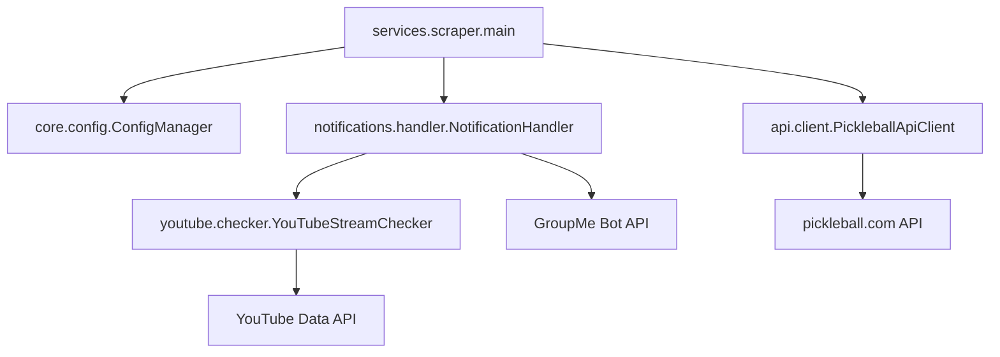

# Package Architecture

This project uses a layered package structure under `pickleball_notifier/`:

- `api`: external API client integrations
- `core`: domain models and configuration persistence
- `notifications`: notification orchestration and message composition
- `services`: application workflows and runnable entrypoints
- `youtube`: YouTube stream lookup integration
- `utils`: shared cross-cutting helpers

## Layer Responsibilities

- Keep I/O boundaries in `api`, `youtube`, and `notifications`.
- Keep state and records in `core`.
- Keep orchestration in `services`.
- Keep reusable helper logic in `utils`.

## Package Export Strategy

All package `__init__.py` files use lazy exports via module-level `__getattr__`.

- Prevents import-time side effects when running module entry points with `python -m ...`.
- Keeps package imports lightweight and avoids preloading workflow modules.
- Maintains stable public imports (for example, `from pickleball_notifier import PickleballPlayerScraper`).

Current lazy-exported modules include:

- `pickleball_notifier/__init__.py`
- `pickleball_notifier/api/__init__.py`
- `pickleball_notifier/core/__init__.py`
- `pickleball_notifier/notifications/__init__.py`
- `pickleball_notifier/services/__init__.py`
- `pickleball_notifier/utils/__init__.py`
- `pickleball_notifier/youtube/__init__.py`

## Where New Code Goes

- New pickleball.com API calls or response parsing: `pickleball_notifier/api/`
- New config fields, match state, or persisted execution data: `pickleball_notifier/core/`
- New GroupMe/notification channels or message templates: `pickleball_notifier/notifications/`
- New workflow steps, scheduling flow, or top-level execution behavior: `pickleball_notifier/services/`
- New YouTube detection or stream-matching behavior: `pickleball_notifier/youtube/`
- Shared utility functions used by multiple layers: `pickleball_notifier/utils/`
- Tests should mirror this layering under `tests/` to keep ownership clear.

## Runtime Flow

## Entry Point

Use:

`make run`
